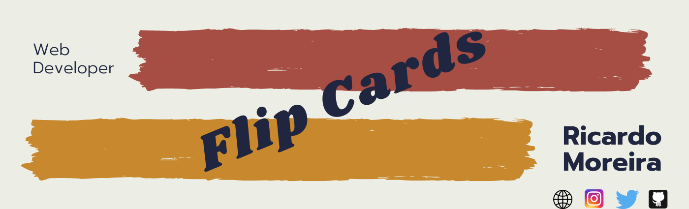
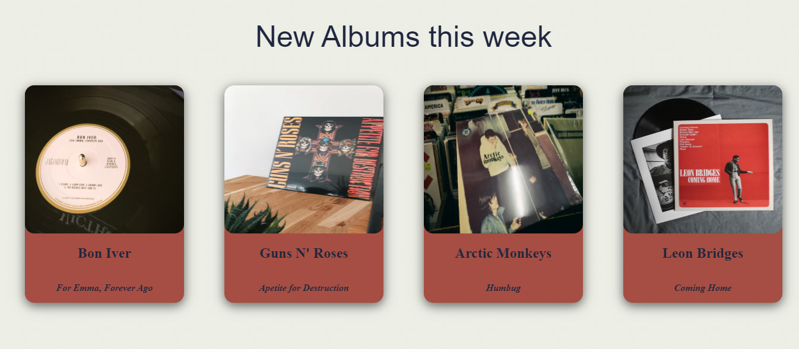
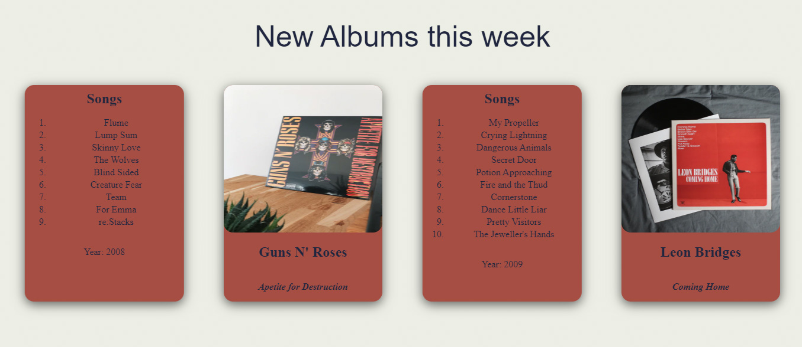

<h1 align="center"> 🔥Flip Cards🔥</h1>

<h2 align="center"> A Music Album page to learn how to flip a card in Javascript </h2>

### Index

* [Name](#Name) 👈
* [Links](#Links) 🔗
* [Description](#Description) 📖
* [Languages and Frameworks](####Languages-and-Frameworks) ⚙️
* [Screenshots](#Screenshots) 📱
* [Instalation](#Instalation) 🧩
* [Support](#Support) 🆘
* [Roadmap](#Roadmap) 🗺️
* [Authors and acknowledgment](####Authors-and-acknowledgment) ✍️
* [Project Status](#Project-Status) 📜

# Name

Flip Card

# Links

[Website](https://goodstuffmusicalbum.netlify.app/)

[Presentation](https://www.ricardomoreira.io/blog/2020-06-15-flip-cards-with-javascript/)
___

# Description

A Page with Album covers that when pressed is fliped/turned and show the other side of the card with more info

___

# Languages, Frameworks and others

* **Javascript** - Language
* **Css** - Styling

____

# Screenshots

Home Page         |  Flip Page
:-------------------------:|:-------------------------:
  |  

____

# Instalation

___

# Support

Have any question or find something that doesn't look good? Let's talk 😊

[Here](https://github.com/mugas)

[And Here](https://www.ricardomoreira.io/about)

____

# Roadmap

Nothing to add

____

# Authors-and-acknowledgment

* Me 😊

____

# Project-Status  

Nothing to add

____
